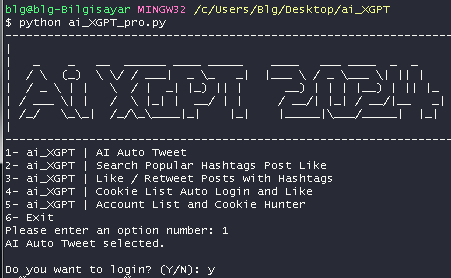

# ai_XGPT Pro v1.0 | Work in progress ...
# Automatic Tweet Publishing Application | https://twitter.com/ai_xgpt

This application runs in the background and publishes posts suitable for your prompt on the X platform at automatically determined times.

## How It Works

This application is developed using Python programming language. It basically follows these steps:

1. **Data Preparation:** Suitable tweets for the topics determined by the user are created.
2. **Scheduling:** The process of publishing tweets at certain time intervals is planned.
3. **Tweet Publishing:** When the scheduled time arrives, the created tweets are automatically published.

## Requirements

To run this application, you will need Python 3 and the following libraries:

- openai
- selenium
- time
- unicodedata

You can install these libraries.

## Usage

1. Clone this repository from GitHub:

git clone https://github.com/gkhantyln/ai_XGPT.git

2. Navigate to the project directory:
cd ai_XGPT

3. Open the `aiXGPT.py` file and edit your OPENAI API keys and other settings.

4. Run the application:
> python `aiXGPT.py`

## Contributions

If you would like to contribute, please open a pull request on GitHub. We welcome any contributions and suggestions.

## License

This project is licensed under the MIT License. For more information, see the [LICENSE](LICENSE) file.

